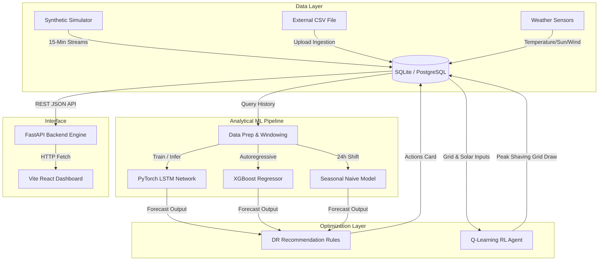

# EcoWatt AI — System Architecture

This document details the architectural design and data flow of **EcoWatt AI (Smart Energy Consumption & Carbon Emission Optimization System)**.

---

## Architectural Data Flow

---

## System Submodules

### 1. Data Ingestion & Simulation
*   **Synthetic Meter Feed**: Generates consumption curves tailored for Residential, Commercial, and Industrial grid consumers (using daily and weekly harmonics, ambient temperature heat loads, and Gaussian noise).
*   **Anomaly Injection**: Emulates meter dropout errors, voltage surge spikes, and equipment load leakages by injecting aberrations labeled in a hidden ground truth.
*   **Renewable Generation Model**: Derives wind and solar output capacity indicators based on atmospheric readings (Pyranometer and Anemometer sensors).

### 2. Preprocessing & Feature Engineering
*   **Moving Average Smoothing**: Dampens transient spike noises.
*   **Temporal Encodings**: Converts datetime indicators into sine/cosine circular variables to expose cyclical patterns.
*   **Sequential Windowing**: Reshapes time series into sliding overlapping blocks (e.g. 96 input steps to predict 24 output steps) for PyTorch sequence training.

### 3. AI forecasting Core
*   **PyTorch LSTM**: Custom sequence model executing backpropagation through time to learn deep temporal relationships.
*   **XGBoost Regressor**: High-speed tree ensemble utilizing lag features and rolling averages, ideal for quick retraining and predicting renewable solar availability.
*   **Seasonal Naive Baseline**: Control benchmark that predicts value at time $t$ based on actual value at $t - 24\text{h}$.

### 4. DR Optimization & Reinforcement Learning
*   **Rule Engine**: Audits projected solar peaks and peaks in building loads to generate actionable load-shifting recommendations.
*   **Q-learning Environment**: Simulates battery storage charging at off-peak rates (or peak solar) and discharging during peak periods.

### 5. UI Presentation
*   **Technology**: React.js with Tailwind CSS styling and Recharts vector lines.
*   **Dynamic Update**: Listens to custom events dispatched by the "Simulate Grid Ingestion Tick" button to update charts instantaneously.
